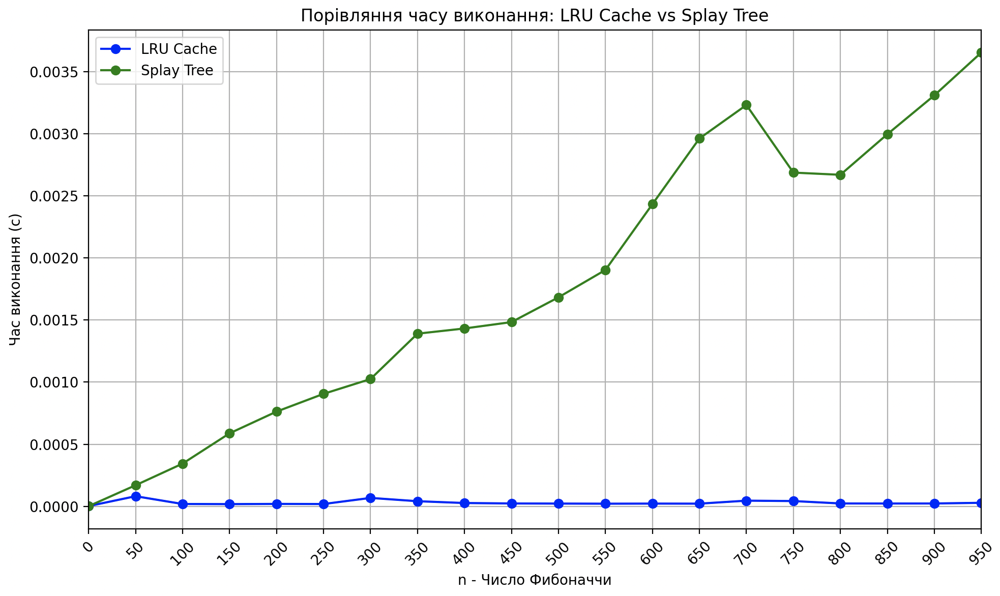
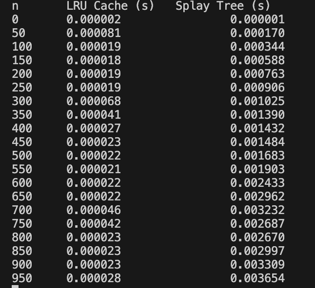

Task 1:
Час виконання без кешування 7.377378225326538 секунд
Час виконання з LRU-кешем: 7.314180850982666 секунд

На віборці данних з 100000 елементів, над якою виконуються 50000 запитів змішанного типу (додавання чи зміна) використання кешу не дає позитивного впливу, або може виявитися навіть повільнішим завдакі витратам на створення та виделення кешу

Task 2:

При  обчисленні послідовності Фібоначчи використання LRU-кешу виявилось значно доцільнишим в порівнянні з використанням Splay Tree 